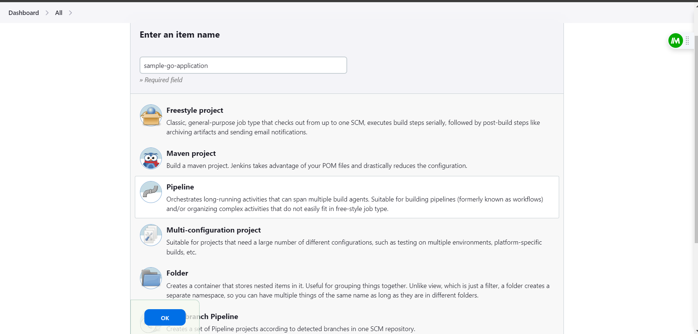

#To Execute this module

Step 1. - Go inside the backend folder of infra `cd ./infra/backend/`
Step 2.- Run the command `terraform init` and `terraform apply --auto-approve`

Once run the above command successfully. A user will get the following value - 

```bucket_region = "ap-south-1"
dynamodb_table_name = "xyz-table-name"
log_bucket_name = "xyz-log-bucket-name"
state_bucket_name = "xyz-state-bucket-name```

Copy the following values and replce it in the backend.tf in the root directory of infra folder and addons folder - 

terraform {
  backend "s3" {
    region = "ap-south-1"
    bucket = "xyz-state-bucket-name"
    key    = "eks/terraform.tfstate"
    dynamodb_table = "xyz-table-name"
  }
}

also in the addons folder at line no 233, where data block for s3 is present, update the s3 bucket name and region according to backend configuration defined - `data "terraform_remote_state" "eks"`

after doing the following changes run `terraform init` in the infra folder.

then run `terraform apply` and carefully see what all resources are going to create, once verified approve it using yes.

Once terraform apply success, go inside the addons folder and repeat the above  steps.

Once apply success in the addons folder - you will see output something like this - 

```
Outputs:

argocd_details = {
  "password" = "hrUZ0hVEIOfPv4IC"
  "url" = "argocd.test.random.com"
  "username" = "admin"
}
jenkins = {
  "password" = "48L8XI9PzvAyQi44ruwuif"
  "url" = "jenkins.test.random.com"
  "username" = "admin"
}
mysql_info = {
  "password" = "abhi1234"
  "root_password" = "1XZ2W2gWyL"
  "host" = "mysqldb.mysql.svc.cluster.local"
  "username" = "abhishek"
}
nginx_ingress_controller_dns_hostname = "ad2e5f214634240c3b06f06cd44b933c-6170c4c17ac4736a.elb.us-west-2.amazonaws.com"

```

pick the `nginx_ingress_controller_dns_hostname` from the above output and create records in your dns providers, based on the domains given.


after creating the records open the jenkins url and login with the creds obtained in the output. - 

Once open the jenkins - 

1. Click on +New item button on the side, enter a name for your pipeline and select `Pipeline` as a type in options.


2. Now go down, and in the pipeline config, choose pipeline script from SCM - 
  a. Choose git in the SCM
  b. Enter the repository URl in this case (https://github.com/abhi-dev91/end-to-end-go-deployment.git)
  c. leave the creds part blank as  this is a public repo and in the branch specifier, specify main.
  4. In the script path, specify the absolute path to jenkinsfile , in this case - app/Jenkinsfile
  5. Now click on the build now button and your application will start building and will be pushed to ECR.
